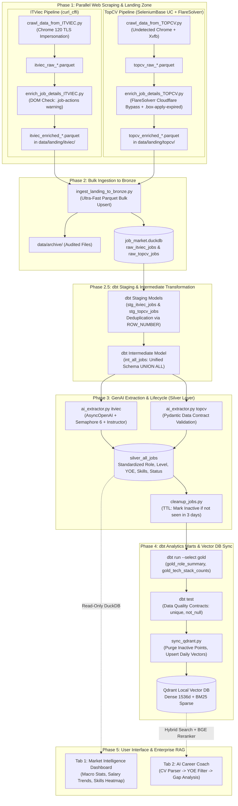

# 🚀 IT Job Market Tracker & AI Career Coach

> **An Enterprise-Grade End-to-End Modern Data & AI Platform**
> Daily automated collection, intelligent cleaning, AI enrichment, vector search, and interactive career advisory for the Vietnamese IT job market.

---

## 🌟 What Is This Project? (In Simple Words)

Imagine having a tireless personal assistant who wakes up every morning at 7:00 AM, browses Vietnam's biggest tech hiring platforms (**ITviec** and **TopCV**), and does the following:

1. **Finds Every New Tech Job:** Scans hundreds of job postings across Software Engineering, Data, DevOps, AI, and Product.
2. **Filters Out the Noise:** Detects and flags expired postings immediately so you never waste time applying to closed positions.
3. **Reads Between the Lines with AI:** Uses GPT-4o-mini to read long, messy job descriptions and extract the core truth: *How many years of experience are truly required? Which 5 tech skills matter most? Is English required?*
4. **Organizes the Data Beautifully:** Cleans and arranges everything into an ultra-fast analytical database (DuckDB).
5. **Acts as Your AI Career Coach:** Allows you to simply drop in your PDF Resume/CV. The system compares your profile against hundreds of active openings, finds your best matches, and provides a customized step-by-step career development roadmap.

---

## 📑 Table of Contents
- [1. System Architecture & Real Execution Flow](#1-system-architecture--real-execution-flow)
- [2. The 4-Tier Expired Job Defense System](#2-the-4-tier-expired-job-defense-system)
- [3. Detailed Pipeline Phases](#3-detailed-pipeline-phases)
- [4. Tech Stack & Engineering Highlights](#4-tech-stack--engineering-highlights)
- [5. Project Directory Structure](#5-project-directory-structure)
- [6. Setup & Installation Guide](#6-setup--installation-guide)
- [7. How to Run the Platform](#7-how-to-run-the-platform)

---

## 1. System Architecture & Real Execution Flow

The platform is designed following the **Medallion Architecture (Landing $\rightarrow$ Bronze $\rightarrow$ Staging/Intermediate $\rightarrow$ Silver $\rightarrow$ Gold)** with a dedicated **Hybrid Vector Database & RAG Serving Layer**.



---

## 2. The 4-Tier Expired Job Defense System

Job postings change rapidly: recruiters take down jobs, or listings expire while their URLs still respond. Stale data wastes candidates' time and wastes costly OpenAI tokens. To solve this, the platform uses a **4-Tier Defense System**:

| Layer | Component | Mechanism | Result |
| :--- | :--- | :--- | :--- |
| **Tier 1: Front-Door Extraction** | `enrich_job_details_*.py` | Inspects live HTML DOM selectors for expiration banners (`.job-actions .bg-light-warning-color` on ITViec, `.box-apply-expired` on TopCV). | Dead jobs are marked with `job_description = 'EXPIRED'` before reaching AI. |
| **Tier 2: AI Staging Gatekeeper** | `ai_extractor.py` | Automatically flags any `EXPIRED` jobs in the Silver table as `status = 'Inactive'`. | Skips calling OpenAI, saving 100% of LLM tokens on dead jobs. |
| **Tier 3: Time-to-Live (TTL) Absence Detection** | `cleanup_jobs.py` | Synchronizes `last_seen_at` with actual crawl timestamps from raw tables and marks jobs missing for **> 3 days** as `Inactive`. | Automatically expires jobs that recruiters quietly delisted without leaving a 410/404 page. |
| **Tier 4: On-Demand Deep Maintenance & Vector Purge** | `purge_expired_jobs.py` & `sync_qdrant.py` | Maintenance crawler checks live HTTP status codes (410/404) and DOM banners with anti-bot pacing. `sync_qdrant.py` removes all inactive points from Qdrant. | Keeps the Vector database 100% synchronized with active listings. |

---

## 3. Detailed Pipeline Phases

### Phase 1: Resilient Scraping & Parquet Landing Zone
- **ITViec Worker (`crawl_data_from_ITVIEC.py` & `enrich_job_details_ITVIEC.py`):**
  Uses `curl_cffi` to impersonate standard browser TLS fingerprints (Chrome 120), bypassing anti-bot blockers and fetching job cards into clean, snappy-compressed Parquet files.
- **TopCV Worker (`crawl_data_from_TOPCV.py` & `enrich_job_details_TOPCV.py`):**
  Uses `SeleniumBase UC (Undetected Chromedriver)` inside an Xvfb virtual display in Docker to handle Cloudflare Turnstile challenges, routing job detail queries through the `FlareSolverr` microservice.
- **Decoupled Landing Zone:**
  Crawlers write files to `data/landing/` without touching the database directly, completely eliminating file locking conflicts.

### Phase 2: Centralized Bronze Ingestion
- `scripts/ingest_landing_to_bronze.py`:
  Connects to DuckDB for less than 1 second to perform high-speed bulk ingestion (`read_parquet`) into `raw_itviec_jobs` and `raw_topcv_jobs`, then archives files to `data/archive/`.

### Phase 2.5: dbt Staging & Intermediate Transformation
- **Staging (`stg_itviec_jobs`, `stg_topcv_jobs`):**
  Deduplicates job entries using `ROW_NUMBER() OVER (PARTITION BY job_id ORDER BY crawl_timestamp DESC)`.
- **Intermediate (`int_all_jobs`):**
  Unifies heterogeneous fields into a single canonical structure.

### Phase 3: GenAI Extraction & Silver Layer
- **Async AI Extractor (`scripts/ai_extractor.py`):**
  Powered by `AsyncOpenAI` and controlled via `asyncio.Semaphore(6)` for high-throughput, rate-limit-safe extraction.
- **Enforced Data Contract (Pydantic & Instructor):**
  Extracts standardized fields:
  - `min_years_of_experience`: Minimum practical years required (integer).
  - `core_tech_stack`: Top 5 primary technologies (e.g., `["Python", "SQL", "AWS"]`).
  - `job_role`: Standardized category (`Backend`, `Data Engineer`, `DevOps/Cloud`, etc.).
  - `job_level`: Hierarchy level (`Intern`, `Fresher`, `Junior`, `Middle`, `Senior`).
  - `english_requirement`: Categorized communication requirement.
- **Job Lifecycle Manager (`scripts/cleanup_jobs.py`):**
  Automatically deactivates stale listings older than 3 days.

### Phase 4: dbt Analytics Marts & Vector Synchronization
- **Gold Marts (`dbt run --select gold`):**
  Aggregates market metrics such as role distributions and tech stack rankings.
- **Data Quality Gate (`dbt test`):**
  Enforces uniqueness, non-null values, and accepted value sets before updating vectors.
- **Vector DB Sync (`scripts/sync_qdrant.py`):**
  - Removes vector points for jobs whose status is no longer `Active`.
  - Generates Dense Embeddings (`text-embedding-3-small`) and Sparse BM25 Embeddings (`FastEmbedSparse`) for **Hybrid Vector Search**.

### Phase 5: Streamlit Serving & AI Career Coach
- **Tab 1 - Market Intelligence Dashboard:**
  Interactive dashboard powered by DuckDB (read-only mode), displaying real-time metrics, role salary distributions, tech stack rankings, and language requirements.
- **Tab 2 - AI Career Coach (Two-Stage Enterprise RAG):**
  1. Candidate uploads a resume in PDF format.
  2. `PyPDFLoader` extracts text, and GPT-4o-mini determines practical experience (Years of Experience) and career focus.
  3. Strict metadata filtering is applied to Qdrant: `metadata.yoe <= candidate_yoe + 1`.
  4. Hybrid Search retrieves the Top 30 candidate positions.
  5. Local Cross-Encoder Reranker (`BAAI/bge-reranker-base`) reranks the Top 10 best fits.
  6. Real-time verification against DuckDB ensures no expired jobs are displayed.
  7. GPT-4o-mini generates a skills gap analysis and a personalized 30-day preparation roadmap.

---

## 4. Tech Stack & Engineering Highlights

| Category | Technology | Purpose |
| :--- | :--- | :--- |
| **Orchestration** | Apache Airflow 2.8.1 | CeleryExecutor with Redis & PostgreSQL for robust scheduling |
| **Data Lakehouse** | DuckDB | Columnar OLAP engine for fast aggregation and transformation |
| **Transformation** | dbt (data build tool) | Medallion architecture (Staging $\rightarrow$ Intermediate $\rightarrow$ Gold) + testing |
| **Vector Engine** | Qdrant Local | Hybrid Search (Dense 1536-dim + BM25 Sparse Vectors) |
| **LLM & Structuring** | OpenAI GPT-4o-mini + Instructor | Async structured information extraction via Pydantic v2 schemas |
| **Reranking** | HuggingFace BAAI/bge-reranker-base | Cross-Encoder for high-precision CV-to-job matching |
| **Web Scraping** | curl_cffi, SeleniumBase, FlareSolverr | Anti-bot bypass, TLS fingerprinting, and Cloudflare challenge solving |
| **User Interface** | Streamlit + Plotly Express | Interactive analytical dashboard and career assistant |

---

## 5. Project Directory Structure

```text
de-job-market-tracker/
├── .env                              # Environment variables (OpenAI API key, cookies, paths)
├── docker-compose.yaml               # Complete stack (Airflow, PostgreSQL, Redis, FlareSolverr)
├── Dockerfile                        # Custom Airflow image with Chrome, Xvfb & PyArrow
├── requirements.txt                  # Consolidated Python dependencies
├── app.py                            # Streamlit Dashboard & AI Career Coach application
├── job_market.duckdb                 # DuckDB database (Bronze, Silver, Gold layers)
├── analytics_dbt/                    # dbt transformation project
│   ├── dbt_project.yml               # dbt configuration
│   ├── profiles.yml                  # Cross-platform profile (Local & Docker)
│   └── models/
│       ├── staging/                  # Deduplication & source standardization
│       ├── intermediate/             # int_all_jobs union model
│       └── marts/                    # Gold analytics marts
├── dags/
│   └── it_job_pipeline.py            # Airflow DAG definition (Runs daily at 07:00 AM VN)
├── data/
│   ├── landing/                      # Landing zone (Temporary Parquet batches)
│   │   ├── itviec/
│   │   └── topcv/
│   └── archive/                      # Historical archive of ingested Parquet files
├── local_qdrant_db/                  # Persistent local Qdrant vector storage
└── scripts/
    ├── crawl_data_from_ITVIEC.py     # ITViec list crawler (curl_cffi)
    ├── enrich_job_details_ITVIEC.py  # ITViec JD details enricher & expiration check
    ├── crawl_data_from_TOPCV.py      # TopCV list crawler (SeleniumBase UC)
    ├── enrich_job_details_TOPCV.py   # TopCV JD details enricher (FlareSolverr)
    ├── ingest_landing_to_bronze.py   # Parquet Landing Zone to DuckDB Bronze Ingestor
    ├── ai_extractor.py               # Async LLM Structured Data Extractor (Silver layer)
    ├── cleanup_jobs.py               # Job lifecycle manager (Stale job deactivator)
    ├── purge_expired_jobs.py         # On-demand deep URL maintenance & verification
    └── sync_qdrant.py                # Hybrid Vector Sync to Qdrant
```

---

## 6. Setup & Installation Guide

### Prerequisites
- [Docker Desktop](https://www.docker.com/) (allocated at least 4 GB RAM)
- Python 3.10+ (for local UI and development)

### 1. Configure Environment Variables
Create a `.env` file in the project root:
```ini
OPENAI_API_KEY=your_openai_api_key_here
ITVIEC_COOKIE=your_itviec_cookie_if_available
TOPCV_COOKIE=your_topcv_cookie_if_available
FLARESOLVERR_URL=http://flaresolverr:8191/v1
DUCKDB_PATH=/opt/airflow/job_market.duckdb
```

### 2. Local Python Environment (For Running Streamlit & dbt Locally)
```bash
# Create and activate virtual environment
python -m venv venv
.\venv\Scripts\activate       # Windows
# source venv/bin/activate    # macOS / Linux

# Install dependencies
pip install -r requirements.txt
```

---

## 7. How to Run the Platform

### Method A: Automated Orchestration via Apache Airflow (Recommended)

1. **Start the Docker Cluster:**
   ```bash
   docker compose up -d --build
   ```
2. **Access Airflow UI:**
   - URL: [http://localhost:8080](http://localhost:8080)
   - Credentials: `airflow` / `airflow`
3. **Trigger Pipeline:**
   - Unpause DAG **`it_job_market_etl_pipeline`**.
   - The DAG runs automatically every day at **07:00 AM (Asia/Ho_Chi_Minh)**, or can be triggered manually at any time.
4. **Launch Streamlit UI:**
   ```bash
   streamlit run app.py
   ```
   - Open [http://localhost:8501](http://localhost:8501) in your browser.

> [!NOTE]
> **Qdrant Storage Lock:** The local Qdrant vector database uses file-level locking. If you run manual maintenance (`python scripts/sync_qdrant.py`), stop Streamlit first (`Ctrl+C`), run the sync, and then restart Streamlit.

---

### Method B: Manual Step-by-Step Execution (Local Testing)

If you wish to test individual components outside of Docker:

```bash
# 1. Crawl and enrich new jobs
python scripts/crawl_data_from_ITVIEC.py
python scripts/enrich_job_details_ITVIEC.py
python scripts/crawl_data_from_TOPCV.py
python scripts/enrich_job_details_TOPCV.py

# 2. Ingest landing Parquet files into DuckDB Bronze
python scripts/ingest_landing_to_bronze.py

# 3. Transform through dbt Staging & Intermediate
cd analytics_dbt
dbt run --select staging intermediate
cd ..

# 4. Extract structured fields with AI & clean up expired jobs
python scripts/ai_extractor.py itviec
python scripts/ai_extractor.py topcv
python scripts/cleanup_jobs.py

# 5. Build Gold analytics marts & verify quality tests
cd analytics_dbt
dbt run --select gold
dbt test
cd ..

# 6. Sync active jobs into Qdrant Vector DB
python scripts/sync_qdrant.py

# 7. Start the Web Dashboard & AI Career Coach
streamlit run app.py
```

---

## 🛡️ License
This project is open-source under the [MIT License](LICENSE). Built for educational, analytical, and career advancement purposes.
