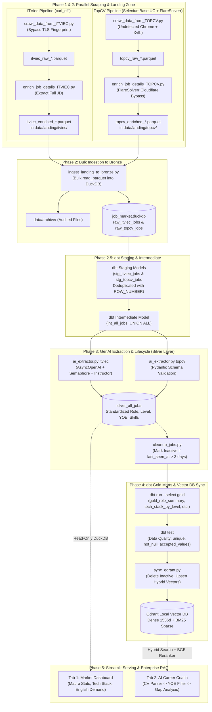

# 🚀 IT Job Market Tracker & AI Career Coach

> **An End-to-End Modern Data & AI Platform** combining Web Scraping (Anti-Bot Bypass), Data Lakehouse (DuckDB + dbt Medallion Architecture), Orchestration (Apache Airflow), Vector Search (Qdrant Hybrid Retrieval), and Generative AI (LLM Extraction, Cross-Encoder Reranking & Career Gap Analysis).

---

## 📑 Table of Contents
- [1. System Architecture & Real Execution Flow](#1-system-architecture--real-execution-flow)
- [2. Detailed Pipeline Phases](#2-detailed-pipeline-phases)
- [3. Key Engineering Highlights](#3-key-engineering-highlights)
- [4. Tech Stack](#4-tech-stack)
- [5. Project Directory Structure](#5-project-directory-structure)
- [6. Setup & Installation Guide](#6-setup--installation-guide)
- [7. How to Run the Platform](#7-how-to-run-the-platform)

---

## 1. System Architecture & Real Execution Flow

The system implements the **Medallion Architecture (Landing $\rightarrow$ Bronze $\rightarrow$ Staging/Intermediate $\rightarrow$ Silver $\rightarrow$ Gold)** with a dedicated **Vector Database & RAG Serving Layer**.



---

## 2. Detailed Pipeline Phases

### Phase 1 & 2: Resilient Scraping & Data Landing Zone
- **ITViec Worker:** Utilizes `curl_cffi` to impersonate Chrome 120 TLS fingerprints, avoiding IP throttling and anti-bot checks. It extracts cards into `itviec_raw_*.parquet`, then crawls full JDs into `itviec_enriched_*.parquet`.
- **TopCV Worker:** Runs in an Xvfb virtual display inside Docker using `SeleniumBase UC (Undetected Chromedriver) Mode` with automatic Cloudflare captcha solvers and session rotation. JD extraction routes through the `FlareSolverr` microservice.
- **Data Landing Zone Pattern:** Crawlers write immutable, snappy-compressed **Parquet** files into `data/landing/`. No direct write connection is held on DuckDB, completely eliminating database locks.

### Phase 2: Centralized Bronze Ingestion
- `scripts/ingest_landing_to_bronze.py`: Opens DuckDB for **under 0.5 seconds** to bulk-upsert all landing Parquet files (`read_parquet`) into `raw_itviec_jobs` and `raw_topcv_jobs`. Processed files are moved to `data/archive/`.

### Phase 2.5: dbt Staging & Intermediate
- **Staging (`stg_itviec_jobs`, `stg_topcv_jobs`):** Deduplicates records by partitioning on `job_id` and ordering by `crawl_timestamp DESC`.
- **Intermediate (`int_all_jobs`):** Unifies schema across both platforms into a normalized staging dataset.

### Phase 3: GenAI Extraction & Job Lifecycle (Silver Layer)
- **Async AI Extractor (`scripts/ai_extractor.py`):** Uses `AsyncOpenAI` controlled by an `asyncio.Semaphore(6)` to process pending jobs in parallel. Structured extraction is enforced via `Instructor` and `Pydantic`:
  - `min_years_of_experience`: Cleaned integer minimum requirement.
  - `core_tech_stack`: Top 5 standardized technical skills.
  - `job_role`: Classified into canonical IT roles (Backend, Data Engineer, DevOps, etc.).
  - `job_level`: Auto-inferred seniority level (Intern, Fresher, Junior, Middle, Senior).
  - `english_requirement`: Categorized proficiency demand.
- **Job Lifecycle Cleanup (`scripts/cleanup_jobs.py`):** Automatically marks jobs as `Inactive` if `last_seen_at < CURRENT_TIMESTAMP - INTERVAL '3 days'`.

### Phase 4: Analytics Marts & Hybrid Vector Sync
- **dbt Gold Marts:** Materializes aggregated tables (`gold_role_summary`, `gold_tech_stack_by_level`, `gold_tech_stack_counts`).
- **dbt Tests:** Validates data contract integrity (`not_null`, `unique`, `accepted_values`) before loading vectors.
- **Qdrant Vector Sync (`scripts/sync_qdrant.py`):**
  - Removes vectors of inactive jobs.
  - Generates Dense Embeddings (`text-embedding-3-small`) and Sparse BM25 Embeddings (`FastEmbedSparse`) for true **Hybrid Search** with reciprocal rank fusion (RRF).

### Phase 5: Streamlit Analytics & Enterprise RAG
- **Tab 1 - Market Intelligence Dashboard:** Visualizes market structure, salary trends, tech stack rankings, and English language demands directly from DuckDB (read-only mode).
- **Tab 2 - AI Career Coach:** 
  1. Candidate uploads a PDF CV.
  2. PDF is parsed and evaluated for practical work experience (YOE) and standardized search query.
  3. Hard metadata filtering applied on Qdrant: `metadata.yoe <= candidate_yoe + 1`.
  4. Hybrid retrieval selects Top 30 candidate jobs.
  5. Cross-Encoder Reranker (`BAAI/bge-reranker-base`) reranks the Top 10 most relevant matches.
  6. LLM generates an executive HR Gap Analysis and a customized 30-day skill acquisition roadmap.

---

## 3. Key Engineering Highlights

| Feature | Implementation Detail |
| :--- | :--- |
| **Concurrency Lock Mitigation** | Decoupled crawlers from DuckDB using a Parquet Landing Zone. Database write window reduced from 20 minutes to < 0.5 seconds. |
| **Async AI Concurrency (10x)** | Upgraded from synchronous loops to `AsyncOpenAI` + `asyncio.Semaphore(6)`. Extraction time for 100 jobs reduced from ~6 minutes to ~35 seconds. |
| **Advanced Anti-Bot Defense** | Dual-tier strategy: `curl_cffi` for TLS fingerprinting + `SeleniumBase UC` & `FlareSolverr` microservice for Cloudflare Turnstile bypass. |
| **Two-Stage RAG Pipeline** | Pre-retrieval query expansion $\rightarrow$ Qdrant Hybrid Search (Dense + BM25) $\rightarrow$ Local Cross-Encoder Reranking (`bge-reranker-base`). |
| **Streamlit Session Cache** | MD5 hash-based caching in `st.session_state` prevents redundant LLM calls when users re-interact with the UI. |
| **Automated Job Lifecycle** | Time-based staleness detection (`last_seen_at > 3 days`) with cascading vector deletion in Qdrant. |

---

## 4. Tech Stack

- **Orchestration:** Apache Airflow 2.8.1 (CeleryExecutor with Redis & PostgreSQL)
- **Database / Data Lakehouse:** DuckDB (OLAP columnar embedded engine)
- **Transformation & Data Quality:** dbt (data build tool) with `dbt-duckdb`
- **Vector Search Engine:** Qdrant (Hybrid Search: Dense + BM25 Sparse)
- **AI / LLM Framework:** OpenAI GPT-4o-mini, Instructor, Pydantic v2, LangChain
- **Embeddings & Reranker:** OpenAI `text-embedding-3-small`, Qdrant BM25 (`FastEmbed`), HuggingFace `BAAI/bge-reranker-base`
- **Scraping & Automation:** SeleniumBase UC Mode, FlareSolverr, curl-cffi, BeautifulSoup4, Xvfb
- **Serving & UI:** Streamlit, Plotly Express, PyPDFLoader

---

## 5. Project Directory Structure

```text
de-job-market-tracker/
├── .env                              # Environment variables (OpenAI API key, cookies, paths)
├── docker-compose.yaml               # Airflow, PostgreSQL, Redis & FlareSolverr stack
├── Dockerfile                        # Custom Airflow image with Chrome, Xvfb & PyArrow
├── requirements.txt                  # Consolidated Python dependencies
├── app.py                            # Streamlit Dashboard & AI Career Coach application
├── job_market.duckdb                 # DuckDB OLAP database (Bronze/Silver/Gold storage)
├── analytics_dbt/                    # dbt project directory
│   ├── dbt_project.yml               # dbt configuration
│   ├── profiles.yml                  # Cross-platform profile (Local fallback / Docker env)
│   └── models/
│       ├── staging/                  # Raw sources & deduplication models
│       ├── intermediate/             # int_all_jobs union model
│       └── marts/                    # Gold analytics marts
├── dags/
│   └── it_job_pipeline.py            # Airflow DAG definition (Parallel orchestration)
├── data/
│   ├── landing/                      # Landing Zone (Temporary Parquet batches)
│   │   ├── itviec/
│   │   └── topcv/
│   └── archive/                      # Historical archive of ingested Parquet files
├── local_qdrant_db/                  # Persistent Qdrant vector storage
└── scripts/
    ├── crawl_data_from_ITVIEC.py     # ITViec list crawler (Parquet output)
    ├── enrich_job_details_ITVIEC.py  # ITViec JD details enricher
    ├── crawl_data_from_TOPCV.py      # TopCV list crawler (SeleniumBase UC)
    ├── enrich_job_details_TOPCV.py   # TopCV JD details enricher (FlareSolverr API)
    ├── ingest_landing_to_bronze.py   # Parquet Landing Zone to DuckDB Bronze Ingestor
    ├── ai_extractor.py               # Async LLM Structured Data Extractor (Silver layer)
    ├── cleanup_jobs.py               # Job lifecycle manager (Stale job deactivator)
    └── sync_qdrant.py                # Hybrid Vector Sync to Qdrant
```

---

## 6. Setup & Installation Guide

### Prerequisites
- [Docker & Docker Desktop](https://www.docker.com/) (allocated at least 4GB RAM)
- Python 3.10+ (for local UI development)

### 1. Clone & Configure Environment Variables
Create a `.env` file in the project root:
```ini
OPENAI_API_KEY=your_openai_api_key_here
ITVIEC_COOKIE=your_itviec_cookie_if_available
TOPCV_COOKIE=your_topcv_cookie_if_available
FLARESOLVERR_URL=http://flaresolverr:8191/v1
DUCKDB_PATH=/opt/airflow/job_market.duckdb
```

### 2. Local Environment Setup (Optional for running Streamlit & dbt locally)
```bash
# Create and activate virtual environment
python -m venv .venv
.venv\Scripts\activate       # Windows
# source .venv/bin/activate  # Linux/Mac

# Install all dependencies
pip install -r requirements.txt
```

---

## 7. How to Run the Platform

### Method A: Automated Orchestration via Apache Airflow (Production)

1. **Build and start the container cluster:**
   ```bash
   docker compose up -d --build
   ```

2. **Access Airflow UI:**
   - URL: [http://localhost:8080](http://localhost:8080)
   - Credentials: `airflow` / `airflow`

3. **Trigger Pipeline:**
   - Unpause DAG **`it_job_market_etl_pipeline`**.
   - Click **Trigger DAG (▶️)**.
   - Monitor the parallel crawler branches and transformations on the **Graph View**.

4. **Launch the User Interface:**
   ```bash
   streamlit run app.py
   ```
   - Access at [http://localhost:8501](http://localhost:8501).

---

### Method B: Manual Step-by-Step Execution (Local Testing)

```bash
# Step 1: Run Crawlers & Enrichers
python scripts/crawl_data_from_ITVIEC.py
python scripts/enrich_job_details_ITVIEC.py

# Step 2: Ingest Parquet batches to DuckDB Bronze
python scripts/ingest_landing_to_bronze.py

# Step 3: Run dbt Staging & Intermediate
cd analytics_dbt
dbt run --select staging intermediate
cd ..

# Step 4: AI Extraction & Lifecycle Cleanup
python scripts/ai_extractor.py itviec
python scripts/cleanup_jobs.py

# Step 5: dbt Gold Marts & Quality Tests
cd analytics_dbt
dbt run --select gold
dbt test
cd ..

# Step 6: Sync Hybrid Vectors to Qdrant
python scripts/sync_qdrant.py

# Step 7: Launch Streamlit Dashboard & AI Coach
streamlit run app.py
```
